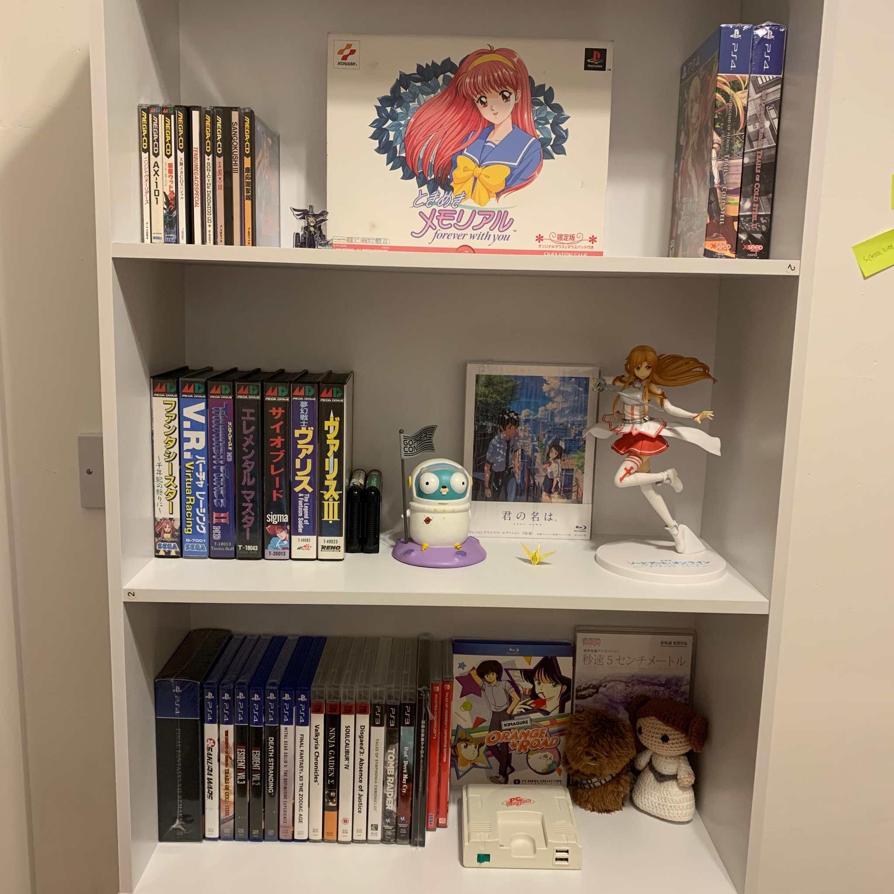

# My Collection

## Consoles

1. Analogue Mega Sg
1. JVC Wondermega RG-M2
1. Nintendo Switch
1. PC Engine Mini
1. Playstation 3
1. Playstation 4

## Mega Drive (NTSC-J)

1. Elemental Master
1. Phantasy Star: The End of the Millennium
1. Psyoblade
1. Sonic The Hedgehog
1. Sonic The Hedgehog 2
1. Thunder Force II
1. V.R. Virtua Racing
1. Valis
1. Valis III

## Mega CD (NTSC-J)

1. AX-101 (sealed)
1. F.H.B. Funky Horror Band (sealed)
1. Keio Yugekitai
1. Ninja Warriors
1. Sangokushi III
1. Sonic The Hedgehog CD
1. Tenbu Mega CD Special

## Nintendo Switch (NTSC-J)

1. Langrisser I&II

## Nintendo Switch (NTSC-U)

1. Tales of Vesperia Definitive Edition
1. Valkyria Chronicles 4

## Playstation (NTSC-J)

1. Tokimeki Memorial Forever With You
1. Tokimeki Memorial Taisen Puzzledama

## Playstation 3

1. Disgaea 3: Absence of Justice
1. DmC Devil May Cry
1. Ninja Gaiden Sigma
1. Soul Calibur IV
1. Tales of Symphonia Chronicles
1. Tomb Raider
1. Valkyria Chronicles

## Playstation 4

1. Death Stranding
1. Final Fantasy VII Remake Deluxe Edition
1. Final Fantaxy XII The Zodiac Age
1. Metal Gear Solid V: The Definitive Experience
1. Resident Evil 2
1. Resident Evil 3
1. Sakura Wars
1. The Legend of Heroes Trails of Cold Steel
1. The Legend of Heroes Trails of Cold Steel II
1. The Legend of Heroes Trails of Cold Steel III
