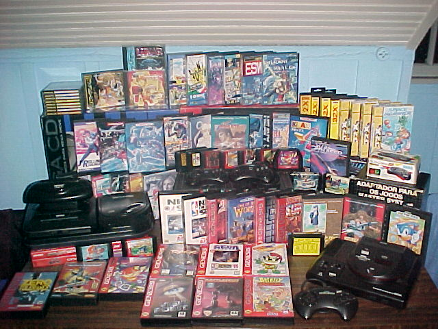

# Danicat's Video Games Wish List <3

Video games were a huge part of my childhood. Born in a poor, disfunctional family they were both my refuge and my best friend. 

Back in the 80's and 90's I couldn't afford the newest generation games and was always one or two generations behind. Nevertheless having those games brought me a lot of joy. 

Eventually I became a video game collector to gather all the games I couldn't afford back in the day. By 2006 I had a very nice collection with dozens of consoles and hundreds of games.

Unfortunately because of financial problems I had to sell them all and by 2012 they were all gone. :(

Now in 2020, I decided to go back to my roots and invest in my collection again. It will be a painful process in some ways, as many of the games I had now are very rare and costs hundreds or even thousands of dollars, but luckily I'm in a better position financially as well! ^_^

I've created this repo to keep track of the items I have and the ones I'm still looking for. It's mostly for my personal use, but if by any chance you have any of those items laying around please let me know :)

Also, if you want to give me a gift and don't know how, this is a good place to start! *wink* *wink* =^_^=

## Retro Games Wish List

This list is currently WIP (probably always will be). I usually look for japanese consoles and games from all generations between 8-bit and 32-bit.

Adventure games, simulation, RPGs, fighting and shooters are my favourite ones. I usually do not like sports games, but there are a few exceptions.

The lists below will be constantly updated to reflect what I'm still looking for.

### How To Use This List

Games are ordered by priority. Games in **bold** are my top priorities at this moment. Games in _itallic_ are in transit right now \o/

### PC Engine (NTSC-J)

1. Cotton
1. Popful Mail
1. Valis
1. Valis II
1. Valis III
1. Valis IV
1. Advanced VG
1. Snatcher
1. Bomberman '94
1. Langrisser II
1. _Langrisser_

### Mega CD (NTSC-J)

1. **Time Gal**
1. Shadownrun
1. Vay
1. Shining Force CD
1. Sol Feace
1. Sega Classics Collection
1. 3x3 Eyes
1. Cosmic Fantasy Stories
1. Devastator
1. Ranma 1/2
1. Urusei Yatsura
1. Yumimi Mix
1. Anett Futatabi
1. Arcus 1-2-3
1. Cyborg 009
1. Death Bringer
1. Illusion City
1. Mahou Shoujo Silky Lip
1. Record of Lodoss War
1. Shin Megami Tensei
1. _Silpheed_
1. _Detonator Orgun_
1. _Lunar Silver Star_
1. _Lunar Eternal Blue_
1. _Popful Mail_

### Sega CD (NTSC-U)

1. **Lunar Silver Star**
1. **Lunar Eternal Blue**
1. **Snatcher**
1. **Popful Mail**
1. **Eternal Champions**
1. **Sonic CD**
1. Rise of the Dragon
1. Dungeon Master II Skullkeep
1. Dracula Unleashed
1. Shining Force CD
1. Vay
1. Dark Wizard
1. Time Gal
1. Mansion of the Hidden Souls
1. Heart of the Alien
1. Wing Commander
1. Cadillacs and Dinosaurs
1. Sega Classics Collection
1. Sol Feace
1. Final Fight CD
1. Keio Flying Squadron
1. Lords of Thunder

### Mega Drive (NTSC-J)

#### S Rank

1. **Twinkle Tale**
1. **Panorama Cotton**
1. **Alien Soldier**
1. Dahna Megami Tanjou
1. _Alisia Dragoon_

#### A Rank

1. **Ex-Ranza**
1. **Shinobi II**
1. **Sonic & Knuckles**
1. Gunstar Heroes
1. Yu Yu Hakusho
1. Bare Knuckle III
1. Golden Axe III
1. Rocket Knight Adventures
1. Splatterhouse II
1. _Arcus Odyssey_
1. _Mamono Hunter Yohko_
1. _Bishoujo Senshi Sailor Moon_

#### B Rank

1. **Bare Knuckle**
1. **Sonic 3**
1. Bare Knuckle II
1. Valis SD
1. Shadow Dancer
1. Shinobi
1. Golden Axe II
1. Thunder Force IV
1. Burning Force
1. Phantasy Star
1. _Rolling Thunder 2_
1. _Battle Golfer Yui_
1. _Golden Axe_

#### C Rank

1. Super Hang On
1. Alien Storm
1. Strider Hiryu
1. Power Athlete
1. Fighting Masters
1. FZ Axis
1. Puyo Puyo Tsu
1. Phantasy Star II
1. Hokuto no Ken
1. Thunder Force III
1. Magical Taruruto Kun
1. Forgotten Worlds
1. Ayrton Senna's Super Monaco GP II
1. Darius II
1. Fushigi no Umi no Nadia
1. Rent a Hero
1. Langrisser
1. Langrisser II
1. Super Street Fighter II
1. _Shining Force II_
1. _Sonic_
1. _Sonic 2_
1. _Phantasy Star III_

### Genesis (NTSC-U)

1. The Immortal
1. Shadow of the Beast
1. Shadow of the Beast II
1. Chakan
1. Alien 3
1. Battletech
1. Flashback
1. Shadowrun
1. Rambo III
1. Pier Solar
1. Quackshot
1. Shining Force
1. Shining Force II
1. Phantasy Star II
1. Phantasy Star III
1. Phantasy Star IV
1. Rolling Thunder 3
1. Desert Strike
1. Jungle Strike
1. Urban Strike
1. Red Zone
1. Ex-Mutants
1. Turrican
1. Syndicate
1. Spiderman vs the Kingpin
1. Populous
1. Comix Zone
1. Moonwalker
1. Road Rash
1. Road Rash II
1. Road Rash III
1. Evander Holyfield Real Deal Boxing
1. Star Trek Next Generation
1. Warlock
1. Zero Tolerance
1. Olympic Gold: Barcelona '92
1. Weaponlord
1. Death Duel
1. Taz-Mania
1. Desert Demolition
1. Cadash
1. Warsong
1. Ferias Frustradas do Pica-Pau (TecToy)
1. Monica na Terra dos Monstros (TecToy)

### Famicom (NTSC-J)

1. Recca
1. Kage Yami no Shigotonin
1. Hiryu no Ken
1. Hiryu no Ken II
1. Hiryu no Ken III
1. Rockman
1. Rockman 2
1. Rockman 3
1. Rockman 4
1. Rockman 5
1. Rockman 6
1. Super Mario Bros
1. Super Mario USA
1. Super Mario Bros 3

### Nintendo (NTSC-U)

1. Shadow of the Ninja
1. Rockin' Kats
1. Felix the Cat

## Contact

Do you have any of the games above and want to make a deal? (or send me a gift? ^_^) Please reach out on daniela.petruzalek@gmail.com or on Twitter @danicat83.
